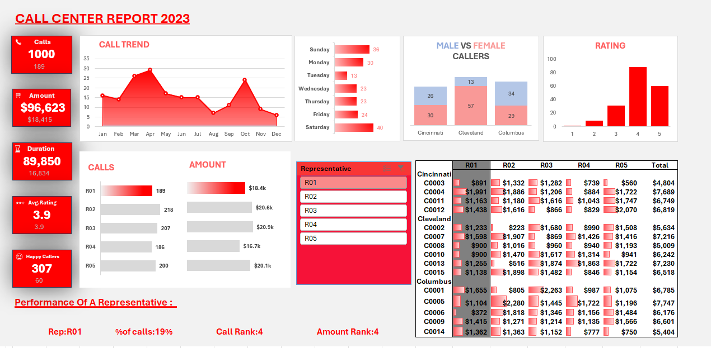

# Call Center Dashboard

An interactive Excel dashboard built to analyze call center performance using Pivot Tables, Pivot Charts, Slicers, KPI Cards, and Conditional Formatting.

## Dashboard Preview

## Features
- Interactive slicers
- KPI cards
- Representative performance analysis
- Revenue analysis
- Customer satisfaction metrics
- Dynamic charts

## Tools Used
- Excel 2021
- Pivot Tables
- Pivot Charts
- Conditional Formatting
- Slicers

## Dataset
Call center performance data for 2023.